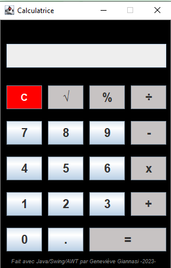

# 🎬 Calculator

Calculator designed for simple calculation operations.

## ♾️ Description

This project was carried out as part of my training: Bachelor Développeur d'application.
It was written under Intellij Idea, with the Swing-AWT graphic interface and coded in Java.

### 🚀 Executing program

```shell
java -jar CalculatriceEntrainement.jar
```

## 👩‍🚀 Authors

Geneviève Genoveffa GIANNASI   
LinkedIn: [@GenevièveGiannasi](www.linkedin.com/in/geneviève-giannasi-99459a7a)

## 📝 License

This project is open source, and it will be released in August 2023.


